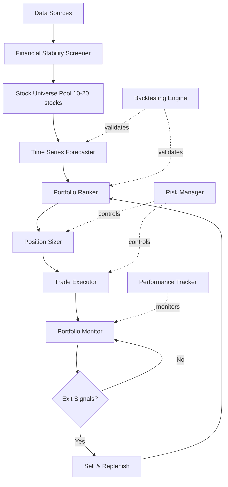

# Automated Stock Trading System - Comprehensive Plan

## Executive Summary

### Project Overview

**Organization**: B. I. Parker Data Science and Consulting LLC
**Project Purpose**: Develop a proprietary quantitative trading system for dual objectives:
1. **Internal Use**: Execute systematic trading strategies using LLC business capital
2. **Commercial Product**: Package and market the system as a SaaS/licensed product to retail and institutional investors

**Goal**: Build a quantitative trading system that selects 10-20 financially stable stocks, uses time series forecasting, sentiment analysis and back-testing to identify high-probability opportunities, and executes a rolling 7 day trading strategy to achieve consistent returns.

### Business Context

**Legal Entity**: B. I. Parker Data Science and Consulting LLC
- Business banking account established
- All trading transactions conducted through LLC account
- System development as intellectual property of the LLC
- Future revenue streams: trading profits + software licensing/subscriptions

**Dual-Track Strategy**:
1. **Track 1 - Internal Trading Operations**: Use system for LLC's own capital deployment
2. **Track 2 - Product Development**: Build commercial-grade platform for external customers. After validation, User UI 
### Trading Parameters

**Budget**: $2,000/month (initial LLC capital allocation)
**Strategy**: Rolling portfolio with weekly rebalancing
**Target**: 1-2% weekly returns (realistic), 3%+ aspirational
**Holding Period**: optimistically, 90 days per position
**Validation**: Backtesting on 1 year historical data before live trading
**Sentiment Analysis

---

## User-Centric Value Proposition

### Core Philosophy: "Trade What You Know"

**The Key Innovation**: Unlike generic robo-advisors that select stocks algorithmically without user input, this system empowers users to leverage their own domain expertise by selecting sectors they understand.

### Target Market

**Primary Customers**:
- **Industry Professionals**: Tech workers trading tech stocks, healthcare professionals trading pharma, finance professionals trading financial services
- **Small Business Owners**: Entrepreneurs investing in industries they operate in
- **Sector Specialists**: Investors with deep knowledge in specific industries
- **Retail Investors**: Anyone with $10K-100K portfolios who has expertise or strong interest in particular sectors
- **Financial Advisors**: Managing client portfolios with sector specialization

### Why Sector Selection Matters

**The Problem with Generic Trading Systems**:
- Most robo-advisors select stocks you don't understand
- Hard to evaluate if a trade makes sense
- Difficult to assess company-specific risks
- Creates anxiety trading unfamiliar companies

**Our Solution**:
> "Your industry knowledge + Our quantitative analysis = Superior returns with confidence"

**User Benefits**:
1. **Leverage Domain Expertise**: Trade in sectors where you have professional or personal knowledge
2. **Better Risk Assessment**: Recognize red flags and opportunities in industries you understand
3. **Informed Decisions**: Understand company news, product launches, competitive dynamics
4. **Confidence**: Trade with conviction based on knowledge, not guesswork
5. **Reduced Anxiety**: Less stress trading familiar companies vs. unknown entities
6. **Competitive Edge**: Your insights + data science = advantage over generic algorithms

### Example Use Cases

**Tech Professional** (Software Engineer):
- Selects: Software, Cloud Computing, Semiconductors
- Advantage: Understands SaaS metrics, recognizes strong vs. weak products, knows which tech trends matter
- Result: Better judgment on earnings reports, product announcements, competitive threats

**Healthcare Worker** (Nurse/Doctor):
- Selects: Pharmaceuticals, Biotechnology, Medical Devices
- Advantage: Knows FDA approval process, understands clinical trial results, recognizes quality of medical products
- Result: Can evaluate drug pipeline news, understand regulatory risks, assess market potential

**Retail Manager**:
- Selects: Retail, E-commerce, Consumer Goods
- Advantage: Recognizes consumer trends, understands supply chain, knows which brands resonate
- Result: Early detection of sales trends, better assessment of inventory issues, understanding of seasonal patterns

**Finance Professional**:
- Selects: Banks, Insurance, Fintech, Asset Management
- Advantage: Understands regulatory environment, recognizes credit risk signals, knows financial metrics
- Result: Better evaluation of earnings quality, understanding of interest rate impacts, assessment of loan portfolios

### Competitive Advantages

1. **User-Centric Sector Selection**: Unlike generic robo-advisors, users choose sectors they know
2. **Knowledge Amplification**: Combines user's domain expertise with quantitative analysis
3. **Real Money Validation**: System proven with LLC's own capital
4. **Data Science Expertise**: Built by experienced data science consultancy
5. **Transparency**: Open methodology, clear risk disclosures
6. **Customization**: Configurable parameters for different risk profiles and sector preferences
7. **Education Focus**: Not just a black box - teaches users about quantitative investing in their sectors
8. **Sector-Specific Insights**: Tailored analysis for each industry vertical

### Commercial Product Features

**Sector Profile Builder**:
- Guided questionnaire to identify user expertise
- Sector knowledge assessment
- Interest and confidence ratings
- Personalized sector recommendations

**Knowledge Base**:
- Educational content about each sector
- Key metrics to watch per industry
- Common risks and opportunities
- Sector-specific news interpretation

**Sector News Feed**:
- Curated news for user's selected sectors
- Earnings calendar for portfolio stocks
- Industry trend analysis
- Competitive intelligence

**Peer Comparison**:
- Compare performance with others in same sector focus
- Sector-specific benchmarks
- Community insights (optional)

---

## System Architecture



---

## Phase 1: Foundation & Research (Week 1-2)

### 1.1 Broker Research & API Evaluation

**Objective**: Determine optimal broker for automated/semi-automated trading

**Options to Evaluate**:

| Broker | API Access | Commission | Fractional Shares | Pros | Cons |
|--------|-----------|-----------|-------------------|------|------|
| Merrill Edge | ❌ No | $0 | ✅ Yes | Bank integration | No automation |
| Interactive Brokers | ✅ Yes (IBKR API) | $0-1 | ✅ Yes | Best API, global | Complex setup |
| Alpaca | ✅ Yes (REST API) | $0 | ✅ Yes | API-first, simple | US stocks only |
| TD Ameritrade | ✅ Yes (migrating) | $0 | ✅ Yes | Good platform | Schwab transition |

**Recommendation**: 
- **Short-term**: Build decision support system for Merrill Edge (manual execution)
- **Long-term**: Migrate to Interactive Brokers or Alpaca for full automation

**Deliverables**:
- Broker comparison document
- API capability assessment
- Integration approach decision

---

### 1.3 System Architecture Design

**Components for Internal Trading**:

1. **Data Layer**
   - Historical price data (yfinance)
   - Fundamental data (financial metrics)
   - Real-time quotes via broker API

2. **Analysis Layer**
   - Financial stability screener
   - Time series forecaster (existing tool)
   - Portfolio optimizer

3. **Execution Layer**
   - Trade signal generator
   - Position sizer
   - Order management via API

4. **Monitoring Layer**
   - Performance tracker
   - Risk monitor
   - Alert system

**Additional Components for Commercial Product**:

5. **User Management Layer**
   - Authentication and authorization
   - Subscription management
   - Multi-tenant data isolation
   - User configuration profiles

6. **API Layer**
   - RESTful API for external integrations
   - Webhook support for real-time notifications
   - Rate limiting and usage tracking
   - API key management

7. **Reporting Layer**
   - Customizable dashboards
   - PDF report generation
   - Email/SMS notifications
   - Performance analytics and benchmarking

8. **Security Layer**
   - Encryption at rest and in transit
   - Audit logging
   - Compliance reporting
   - Data privacy controls (GDPR, CCPA)

**Deliverables**:
- System architecture diagram (internal + commercial)
- Component interaction flowchart
- Data flow specification
- Security architecture document
- Scalability plan for multi-user deployment

---

## Phase 2: Core Modules Development (Week 3-6)

### 2.1 User-Centric Sector Selection & Screening Module

**Purpose**: Enable users to leverage their domain expertise by selecting sectors they know and understand

**Key Innovation**: Users select sectors based on their knowledge, interest, and expertise rather than using a generic stock universe.

**User Sector Selection Interface**:

```python
AVAILABLE_SECTORS = {
    'Technology': ['Software', 'Hardware', 'Semiconductors', 'IT Services', 'Cloud Computing'],
    'Healthcare': ['Pharmaceuticals', 'Biotechnology', 'Medical Devices', 'Healthcare Services'],
    'Financial Services': ['Banks', 'Insurance', 'Asset Management', 'Fintech', 'REITs'],
    'Consumer': ['Retail', 'E-commerce', 'Consumer Goods', 'Restaurants', 'Apparel'],
    'Energy': ['Oil & Gas', 'Renewable Energy', 'Utilities', 'Energy Equipment'],
    'Industrials': ['Aerospace', 'Manufacturing', 'Transportation', 'Construction'],
    'Materials': ['Chemicals', 'Metals & Mining', 'Paper & Packaging'],
    'Communications': ['Telecom', 'Media', 'Entertainment', 'Advertising'],
    'Real Estate': ['REITs', 'Real Estate Services', 'Property Development'],
    'Consumer Staples': ['Food & Beverage', 'Household Products', 'Tobacco']
}

USER_SECTOR_CONFIG = {
    'selected_sectors': [],  # User chooses 2-4 sectors they understand
    'sector_weights': {},    # Optional: weight allocation per sector
    'excluded_companies': [], # Companies user wants to avoid
    'preferred_companies': [] # Companies user specifically wants to include
}
```

**Screening Workflow**:

1. **User Sector Selection**
   - User selects 2-4 sectors they have knowledge/interest in
   - System explains why sector knowledge matters (better judgment on news, trends, risks)
   - User can add notes about their expertise in each sector

2. **Sector-Specific Stock Screening**
   - Filter stocks within selected sectors only
   - Apply financial stability criteria
   - Rank by user's sector preferences

3. **Financial Stability Criteria** (configurable per sector):

```python
STABILITY_FILTERS = {
    'market_cap_min': 10_000_000_000,  # $10B minimum
    'pe_ratio_max': 30,                 # P/E < 30 (adjustable by sector)
    'debt_to_equity_max': 2.0,          # D/E < 2.0 (varies by sector)
    'current_ratio_min': 1.5,           # Current assets/liabilities
    'profit_margin_min': 0.05,          # 5% profit margin
    'revenue_growth_min': 0.03,         # 3% YoY growth
    'free_cash_flow_positive': True,
    'dividend_history_years': 3,        # Optional: dividend payers
}

# Sector-specific adjustments
SECTOR_ADJUSTMENTS = {
    'Technology': {'pe_ratio_max': 40, 'debt_to_equity_max': 1.5},
    'Utilities': {'pe_ratio_max': 20, 'debt_to_equity_max': 3.0},
    'Financial Services': {'debt_to_equity_max': 5.0},  # Different for banks
    # ... other sector-specific criteria
}
```

**User Benefits**:
- **Leverage Domain Knowledge**: Trade in sectors you understand
- **Better Risk Assessment**: Recognize sector-specific risks and opportunities
- **Informed Decisions**: Understand company news and industry trends
- **Confidence**: Trade what you know, not random stocks
- **Customization**: Focus on industries aligned with your interests

**Commercial Product Feature**:
- **Sector Profile Builder**: Guided questionnaire to identify user expertise
- **Knowledge Base**: Educational content about each sector
- **Sector News Feed**: Curated news for user's selected sectors
- **Peer Comparison**: Compare performance within same sector focus

**Data Sources**:
- yfinance (basic fundamentals + sector classification)
- Alpha Vantage API (detailed fundamentals)
- Financial Modeling Prep API (sector-specific metrics)

**Output**:
- Filtered list of 10-20 stocks from user's selected sectors
- Stability scores for each stock
- Sector allocation breakdown
- User expertise match score

**File**: `src/sector_selector.py` and `src/stability_screener.py`

---

### 2.2 Enhanced Time Series Forecaster

**Modifications to Existing Tool**:

1. **Optimize for 7-14 Day Horizon**
   - Adjust `FORECAST_DAYS` in config to 7-14
   - Retrain models for shorter timeframe
   - Increase weight on recent data

2. **Add Confidence Scoring**
   - Calculate forecast reliability score
   - Factor in volatility and trend strength
   - Penalize wide confidence intervals

3. **Multi-Stock Batch Processing**
   - Process 10-20 stocks efficiently
   - Parallel execution for speed
   - Caching for repeated analyses

**Enhanced Config**:
```python
# time_series_analyzer/src/config.py additions
FORECAST_DAYS = 10  # Changed from 36 to 10 for weekly strategy
LOOKBACK_DAYS = 180  # Reduced from 365 for faster processing
CONFIDENCE_THRESHOLD = 0.7  # Minimum confidence for trade signals
```

**File**: Modify `time_series_analyzer/src/config.py` and `main_analyzer.py`

---

### 2.3 Stock Universe Manager

**Purpose**: Maintain dynamic pool of eligible stocks based on user's sector preferences

**Features**:
- Daily/weekly refresh of stability screening within user's sectors
- Remove stocks that no longer meet criteria
- Add new candidates that pass filters in selected sectors
- Track stock lifecycle (added date, removed date, reason)
- Store user sector preferences and expertise levels

**Enhanced Database Schema** (SQLite):
```sql
CREATE TABLE user_profiles (
    user_id TEXT PRIMARY KEY,
    created_date DATE,
    risk_tolerance TEXT,
    investment_goals TEXT
);

CREATE TABLE user_sector_preferences (
    user_id TEXT,
    sector TEXT,
    subsector TEXT,
    expertise_level TEXT,  -- 'beginner', 'intermediate', 'expert'
    interest_level INTEGER, -- 1-5 rating
    notes TEXT,
    PRIMARY KEY (user_id, sector)
);

CREATE TABLE stock_universe (
    ticker TEXT PRIMARY KEY,
    company_name TEXT,
    sector TEXT,
    subsector TEXT,
    added_date DATE,
    removed_date DATE,
    stability_score REAL,
    market_cap REAL,
    status TEXT  -- 'active', 'removed', 'watchlist'
);

CREATE TABLE user_stock_universe (
    user_id TEXT,
    ticker TEXT,
    added_date DATE,
    removed_date DATE,
    user_notes TEXT,
    PRIMARY KEY (user_id, ticker)
);
```

**User-Specific Features**:
- Each user has their own stock universe based on sector selections
- System suggests stocks within user's expertise areas
- Users can manually add/remove stocks from their universe
- Track why user included/excluded specific stocks

**File**: `src/universe_manager.py` and `src/user_profile_manager.py`

---

### 2.4 Portfolio Ranking System

**Purpose**: Score and rank stocks for trading priority

**Ranking Factors**:

1. **Forecast Performance** (40% weight)
   - Expected return over 7-14 days
   - Confidence level of forecast
   - Historical forecast accuracy

2. **Risk Metrics** (30% weight)
   - Volatility (lower is better for stability)
   - Beta (market correlation)
   - Maximum drawdown potential

3. **Fundamental Strength** (20% weight)
   - Stability score from screener
   - Recent earnings performance
   - Analyst sentiment (if available)

4. **Technical Indicators** (10% weight)
   - RSI (avoid overbought/oversold)
   - MACD signals
   - Volume trends

**Scoring Formula**:
```python
composite_score = (
    0.40 * forecast_score +
    0.30 * risk_score +
    0.20 * fundamental_score +
    0.10 * technical_score
)
```

**Output**: Ranked list of stocks with buy signals

**File**: `src/portfolio_ranker.py`

---

## Phase 3: Backtesting Framework (Week 7-9)

### 3.1 Backtesting Engine

**Purpose**: Validate strategy on historical data before risking capital

**Backtesting Parameters**:
- **Period**: 2-3 years (2021-2024)
- **Initial Capital**: $1,000
- **Rebalancing**: Weekly
- **Transaction Costs**: $0 commission + 0.1% slippage
- **Position Limits**: Max 10 positions, $100-150 per position

**Simulation Logic**:

```python
class BacktestEngine:
    def __init__(self, start_date, end_date, initial_capital):
        self.capital = initial_capital
        self.positions = {}
        self.trade_history = []
        
    def run_backtest(self):
        for week in date_range(start_date, end_date, freq='W'):
            # 1. Screen for stable stocks
            universe = screen_stocks(week)
            
            # 2. Generate forecasts
            forecasts = forecast_stocks(universe, horizon=10)
            
            # 3. Rank and select top stocks
            ranked = rank_portfolio(forecasts)
            top_picks = ranked[:10]
            
            # 4. Check exit signals for current positions
            exits = check_exit_signals(self.positions, week)
            self.execute_sells(exits)
            
            # 5. Size and enter new positions
            new_positions = size_positions(top_picks, self.capital)
            self.execute_buys(new_positions)
            
            # 6. Update portfolio value
            self.update_portfolio_value(week)
```

**Metrics to Track**:
- Total return (%)
- Annualized return (%)
- Win rate (% profitable trades)
- Average gain per trade
- Average loss per trade
- Maximum drawdown
- Sharpe ratio
- Sortino ratio
- Number of trades

**File**: `src/backtesting_engine.py`

---

### 3.2 Performance Validation

**Success Criteria**:
- ✅ Positive returns in 60%+ of weeks
- ✅ Average weekly return > 0.5%
- ✅ Maximum drawdown < 15%
- ✅ Sharpe ratio > 1.0
- ✅ Win rate > 55%

**If Criteria Not Met**:
- Adjust screening parameters
- Modify ranking weights
- Change holding period
- Add stop-loss rules
- Reduce position sizes

**Deliverables**:
- Backtesting report with all metrics
- Trade-by-trade analysis
- Parameter sensitivity analysis
- Strategy refinement recommendations

---

## Phase 4: Trading Execution System (Week 10-12)

### 4.1 Position Sizing Module

**Purpose**: Allocate capital efficiently across positions

**Sizing Strategy**:

```python
def calculate_position_sizes(ranked_stocks, available_capital, max_positions=10):
    """
    Equal-weight with risk adjustment
    """
    base_allocation = available_capital / max_positions
    
    positions = []
    for stock in ranked_stocks[:max_positions]:
        # Adjust for volatility (lower vol = larger position)
        volatility_factor = 1.0 / (1.0 + stock['volatility'])
        
        # Adjust for confidence (higher confidence = larger position)
        confidence_factor = stock['forecast_confidence']
        
        # Calculate final position size
        position_size = base_allocation * volatility_factor * confidence_factor
        
        # Apply limits
        position_size = min(position_size, available_capital * 0.15)  # Max 15% per position
        position_size = max(position_size, available_capital * 0.05)  # Min 5% per position
        
        positions.append({
            'ticker': stock['ticker'],
            'size': position_size,
            'shares': position_size / stock['current_price']
        })
    
    return positions
```

**File**: `src/position_sizer.py`

---

### 4.2 Trade Execution Module

**Two Modes**:

**Mode 1: Manual Execution (Merrill Edge)**
```python
def generate_trade_orders(positions, action='BUY'):
    """
    Export CSV for manual execution
    """
    orders = []
    for pos in positions:
        orders.append({
            'Ticker': pos['ticker'],
            'Action': action,
            'Shares': pos['shares'],
            'Order_Type': 'Market',
            'Time_In_Force': 'Day'
        })
    
    df = pd.DataFrame(orders)
    df.to_csv(f'trade_orders_{datetime.now():%Y%m%d}.csv')
    return df
```

**Mode 2: API Execution (Interactive Brokers/Alpaca)**
```python
def execute_trades_api(positions, api_client):
    """
    Automated execution via broker API
    """
    for pos in positions:
        order = api_client.submit_order(
            symbol=pos['ticker'],
            qty=pos['shares'],
            side='buy',
            type='market',
            time_in_force='day'
        )
        log_trade(order)
```

**File**: `src/trade_executor.py`

---

### 4.3 Exit Signal Detection

**Exit Triggers**:

1. **Time-Based**: 7-14 days elapsed
2. **Target Met**: Gain exceeds threshold (e.g., 3%)
3. **Stop-Loss**: Loss exceeds threshold (e.g., -3%)
4. **Forecast Reversal**: New forecast turns negative
5. **Stability Breach**: Stock removed from universe

**Implementation**:
```python
def check_exit_signals(position, current_data):
    """
    Evaluate if position should be closed
    """
    signals = []
    
    # Time-based
    if position['days_held'] >= 14:
        signals.append(('TIME_LIMIT', 'Held for 14 days'))
    
    # Profit target
    gain_pct = (current_data['price'] - position['entry_price']) / position['entry_price']
    if gain_pct >= 0.03:
        signals.append(('TARGET_MET', f'Gain: {gain_pct:.2%}'))
    
    # Stop loss
    if gain_pct <= -0.03:
        signals.append(('STOP_LOSS', f'Loss: {gain_pct:.2%}'))
    
    # Forecast reversal
    new_forecast = get_latest_forecast(position['ticker'])
    if new_forecast['expected_return'] < 0:
        signals.append(('FORECAST_REVERSAL', 'Negative outlook'))
    
    return signals
```

**File**: `src/exit_detector.py`

---

### 4.4 Portfolio Replenishment System

**Purpose**: Automatically replace sold positions

**Logic**:
1. Detect positions closed during week
2. Calculate freed capital
3. Re-run ranking on current universe
4. Select top-ranked stocks not currently held
5. Size new positions
6. Generate buy orders

**File**: `src/replenishment_manager.py`

---

## Phase 5: Risk Management (Week 13-14)

### 5.1 Risk Controls

**Position-Level Limits**:
- Max position size: 15% of portfolio
- Min position size: 5% of portfolio
- Stop-loss: -2% per position
- Max holding period: 14 days

**Portfolio-Level Limits**:
- Max positions: 10 concurrent
- Max sector exposure: 30% per sector
- Daily loss limit: -3% of portfolio
- Weekly loss limit: -5% of portfolio

**Implementation**:
```python
class RiskManager:
    def validate_trade(self, position, portfolio):
        """
        Check if trade passes risk controls
        """
        checks = {
            'position_size': self.check_position_size(position),
            'sector_exposure': self.check_sector_limit(position, portfolio),
            'daily_loss': self.check_daily_loss(portfolio),
            'correlation': self.check_correlation(position, portfolio)
        }
        
        return all(checks.values()), checks
```

**File**: `src/risk_manager.py`

---

### 5.2 Diversification Rules

**Sector Allocation**:
- Technology: Max 30%
- Healthcare: Max 25%
- Financials: Max 20%
- Consumer: Max 20%
- Other: Max 15%

**Correlation Limits**:
- Avoid highly correlated positions (correlation > 0.8)
- Ensure portfolio beta stays between 0.8-1.2

**File**: `src/diversification_manager.py`

---

## Phase 6: Monitoring & Reporting (Week 15-16)

### 6.1 Performance Tracking Dashboard

**Metrics to Display**:

**Portfolio Overview**:
- Current value
- Total return ($ and %)
- Today's P&L
- Week's P&L
- Month's P&L

**Position Details**:
- Ticker, entry date, entry price
- Current price, current value
- Unrealized P&L
- Days held
- Exit signals (if any)

**Performance Metrics**:
- Win rate
- Average gain per trade
- Average loss per trade
- Sharpe ratio
- Maximum drawdown
- Total trades executed

**Implementation**: Web dashboard using Streamlit or Flask

**File**: `src/dashboard.py`

---

### 6.2 Alert System

**Alert Triggers**:
- Position hits stop-loss
- Position reaches profit target
- Daily loss limit approached
- New high-confidence trade signal
- System errors or data issues

**Notification Methods**:
- Email alerts
- SMS (via Twilio)
- Desktop notifications
- Log file entries

**File**: `src/alert_manager.py`

---

## Phase 7: Configuration & Documentation (Week 17-18)

### 7.1 Configuration System

**Config File Structure** (`config/trading_config.yaml`):

```yaml
# Capital Management
initial_capital: 1000
max_positions: 10
position_size_min_pct: 0.05
position_size_max_pct: 0.15

# Strategy Parameters
holding_period_min: 7
holding_period_max: 14
profit_target_pct: 0.03
stop_loss_pct: -0.02

# Screening Criteria
stability_filters:
  market_cap_min: 10000000000
  pe_ratio_max: 30
  debt_to_equity_max: 2.0
  profit_margin_min: 0.05

# Forecasting
forecast_horizon_days: 10
confidence_threshold: 0.7
lookback_days: 180

# Risk Management
daily_loss_limit_pct: -0.03
weekly_loss_limit_pct: -0.05
max_sector_exposure_pct: 0.30

# Execution
broker: 'manual'  # or 'alpaca', 'ibkr'
execution_mode: 'csv_export'  # or 'api'
```

**File**: `config/trading_config.yaml`

---

### 7.2 Documentation

**User Guide** (`docs/USER_GUIDE.md`):
- Installation instructions
- Configuration guide
- Running backtests
- Executing trades
- Interpreting results
- Troubleshooting

**Strategy Documentation** (`docs/STRATEGY.md`):
- Strategy overview
- Selection criteria
- Ranking methodology
- Risk management rules
- Expected performance

**API Documentation** (`docs/API.md`):
- Module descriptions
- Function references
- Usage examples
- Integration guide

---

## Project Structure

```
trading-system/
├── config/
│   ├── trading_config.yaml
│   └── broker_credentials.yaml (gitignored)
├── src/
│   ├── __init__.py
│   ├── stability_screener.py
│   ├── universe_manager.py
│   ├── portfolio_ranker.py
│   ├── position_sizer.py
│   ├── trade_executor.py
│   ├── exit_detector.py
│   ├── replenishment_manager.py
│   ├── risk_manager.py
│   ├── diversification_manager.py
│   ├── backtesting_engine.py
│   ├── performance_tracker.py
│   ├── alert_manager.py
│   └── dashboard.py
├── time_series_analyzer/  (existing)
│   └── [existing files]
├── data/
│   ├── stock_universe.db
│   ├── trade_history.db
│   └── performance_metrics.db
├── output/
│   ├── trade_orders/
│   ├── reports/
│   └── backtest_results/
├── tests/
│   ├── test_screener.py
│   ├── test_ranker.py
│   ├── test_backtesting.py
│   └── test_risk_manager.py
├── docs/
│   ├── USER_GUIDE.md
│   ├── STRATEGY.md
│   └── API.md
├── main.py
├── requirements.txt
└── README.md
```

---

## Implementation Timeline

| Phase | Duration | Key Deliverables |
|-------|----------|------------------|
| 1. Foundation & Research | 2 weeks | Broker decision, architecture design |
| 2. Core Modules | 4 weeks | Screener, forecaster, ranker, universe manager |
| 3. Backtesting | 3 weeks | Backtesting engine, validation report |
| 4. Execution System | 3 weeks | Position sizer, trade executor, exit detector |
| 5. Risk Management | 2 weeks | Risk controls, diversification rules |
| 6. Monitoring & Reporting | 2 weeks | Dashboard, alerts, performance tracking |
| 7. Configuration & Docs | 2 weeks | Config system, user guide, API docs |
| **Total** | **18 weeks** | **Fully functional trading system** |

---

## Risk Disclosure & Realistic Expectations

### Expected Performance

**Conservative Estimate**:
- Weekly return: 0.5-1.0%
- Monthly return: 2-4%
- Annual return: 25-50%
- Win rate: 55-65%
- Maximum drawdown: 10-20%

**Best Case** (favorable market):
- Weekly return: 1.5-2.5%
- Monthly return: 6-10%
- Annual return: 75-120%

**Worst Case** (bear market):
- Weekly return: -1.0% to 0%
- Monthly return: -4% to 0%
- Annual return: -20% to 0%

### Key Success Factors

✅ **What Increases Success Probability**:
- Disciplined execution (follow system signals)
- Proper risk management (stop-losses, position limits)
- Regular backtesting and strategy refinement
- Market conditions (bull markets favor momentum strategies)
- Quality data and accurate forecasts

❌ **What Decreases Success**:
- Emotional trading (overriding system)
- Ignoring risk controls
- Over-optimization (curve fitting to past data)
- High transaction costs
- Poor market conditions (high volatility, bear markets)

### Important Disclaimers

⚠️ **This system is for educational purposes only**
- Not financial advice
- Past performance ≠ future results
- Significant risk of capital loss
- Consult licensed financial advisor
- Start with paper trading
- Use only risk capital you can afford to lose

---

## Next Steps

1. **Review this plan** and provide feedback
2. **Decide on broker** (Merrill Edge manual vs API-enabled broker)
3. **Approve architecture** and component design
4. **Begin Phase 1** implementation
5. **Set up development environment**

---

## Questions for Clarification

1. **Broker Decision**: Proceed with Merrill Edge (manual) or switch to API-enabled broker?
2. **Risk Tolerance**: Comfortable with 10-20% potential drawdown?
3. **Time Commitment**: Available for daily monitoring or prefer weekly check-ins?
4. **Options Trading**: Still interested in options or focus on stocks only?
5. **Development Timeline**: 18-week timeline acceptable or need faster deployment?

---

**Ready to proceed with implementation once you approve this plan and answer the clarification questions.**